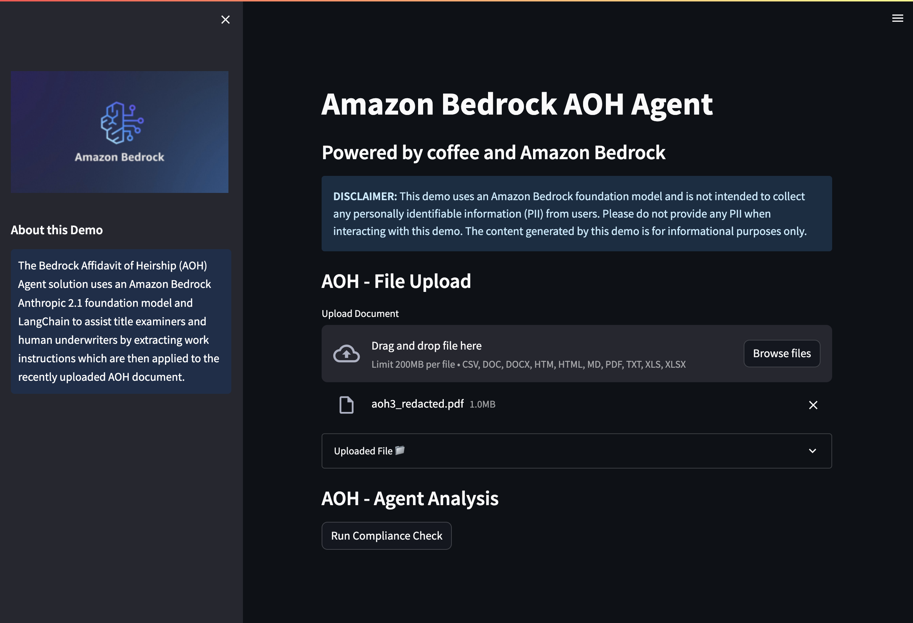
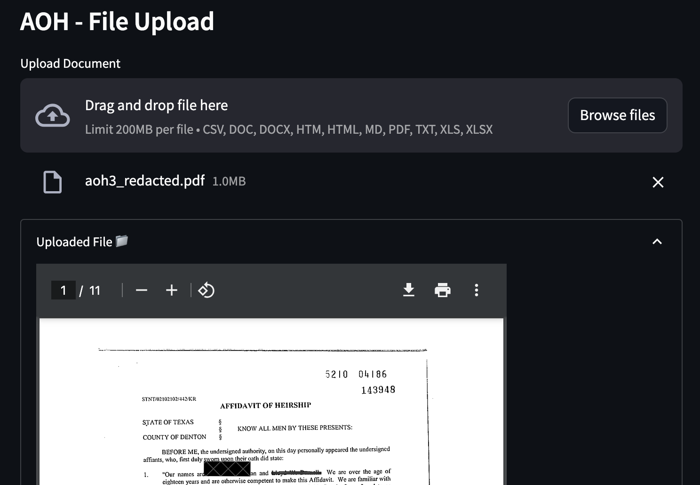
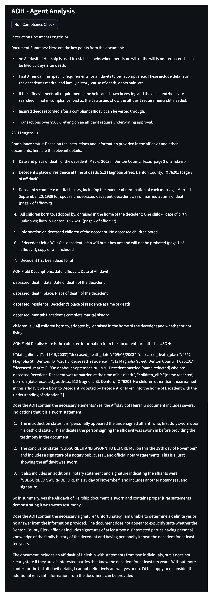

## Deploy Streamlit Web UI for Your Agent
We use [Streamlit](https://streamlit.io/) in this solution to launch an example frontend, intended to emulate a production application. Streamlit is a Python library designed to streamline and simplify the process of building frontend applications. Our application provides two features:


- **AOH - File Upload:** Enables the user to upload their local AOH document to the Amazon S3 bucket that is being used as the [AmazonTextractPDFLoader](https://api.python.langchain.com/en/latest/document_loaders/langchain_community.document_loaders.pdf.AmazonTextractPDFLoader.html) data source.
- **AOH - Agent Analysis:** Once a file is uploaded, this option becomes visible, allowing the user to automate the interpretation and fulfillment of AOH work instructions on a specific AOH document to determine compliance with FA requirements. 

To isolate our Streamlit application dependencies and for ease of deployment, we use the [setup-streamlit-env.sh](../agent/streamlit/setup-streamlit-env.sh) shell script to create a virtual Python environment with the requirements installed.

1.	Before you run the shell script, navigate to the directory where you cloned the amazon-bedrock-samples repository and modify the Streamlit shell script permissions to executable:

```sh 
# If not already cloned, clone the remote repository (https://github.com/aws-samples/amazon-bedrock-samples) and change working directory to insurance agent shell folder
cd aoh-automation/shell/
chmod u+x create-streamlit-env.sh
```

2.	Run the shell script to activate the virtual Python environment with the required dependencies:

```sh 
source ./create-streamlit-env.sh
```

3.	Set your Bedrock agent ID, agent alias ID, knowledge base ID, data source ID, and knowledge base bucket name environment variables.

```sh 
export AWS_REGION=<YOUR-AWS-REGION> # Region into which you deployed the stack
```

4.	Run your Streamlit application and begin testing in your local web browser:

```sh 
streamlit run aoh_streamlit.py
```

#### Streamlit UI

<p align="center">
  <br>
  <span style="display: block; text-align: center;"><em>Figure 1: Streamlit AOH Application</em></span>
</p>

#### AOH - File Upload

<p align="center">
  <br>
  <span style="display: block; text-align: center;"><em>Figure 2: AOH File Upload Feature</em></span>
</p>

#### AOH - Agent Analysis

<p align="center">
  <br>
  <span style="display: block; text-align: center;"><em>Figure 3: AOH Agent Analyis Feature</em></span>
</p>

While the demonstrated solution showcases the capabilities of Amazon Bedrock FMs with LangChain, it is important to understand that this solution is not Production-ready. Rather, it serves as a conceptual guide for developers aiming to create personalized agents for their own specific tasks and automated workflows. Developers aiming for production deployment should refine and adapt this initial model, keeping in mind the several key considerations outlined in the [Amazon Bedrock generative AI agent blog](https://aws.amazon.com/blogs/machine-learning/build-generative-ai-agents-with-amazon-bedrock-amazon-dynamodb-amazon-kendra-amazon-lex-and-langchain/).

## Resources
- [Generative AI on AWS](https://aws.amazon.com/generative-ai/)
- [Amazon Bedrock](https://aws.amazon.com/bedrock/)
- [LangChain LLMChain](https://api.python.langchain.com/en/latest/chains/langchain.chains.llm.LLMChain.html#langchain.chains.llm.LLMChain)

---

Copyright Amazon.com, Inc. or its affiliates. All Rights Reserved.
SPDX-License-Identifier: MIT-0
